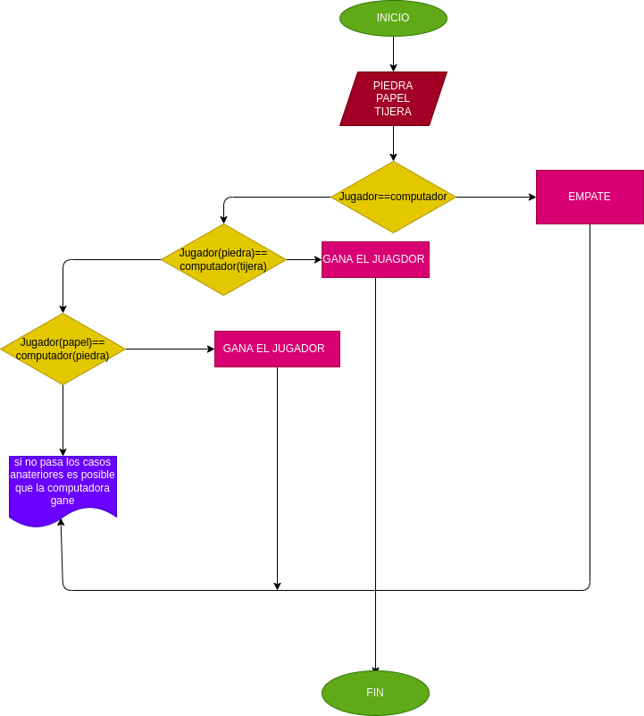

# piedra-papel-o-tijera
este es un juego de piedra, papel o tijera donde lo jugabamos cuando eraos niños y aun lo segimos jugando 

## varable de entrada

El juego "Piedra, Papel y Tijera" es un juego simple que involucra dos jugadores que eligen entre tres opciones: piedra, papel o tijera. Las reglas del juego son las siguientes:

La piedra aplasta la tijera (la piedra gana).
La tijera corta el papel (la tijera gana).
El papel envuelve la piedra (el papel gana).

Si ambos jugadores eligen la misma opción, el juego es un empate.

## variable de salida

1. Seleccionar aleatoriamente una opción para cada jugador: piedra, papel o tijera.
2. Comparar las elecciones de los dos jugadores según las reglas del juego.
3. Determinar el resultado de la partida: empate, gana el jugador 1, o gana el jugador 2.
4. Mostrar el resultado por pantalla.

# DISEÑO 

# CONSTRUCCION

